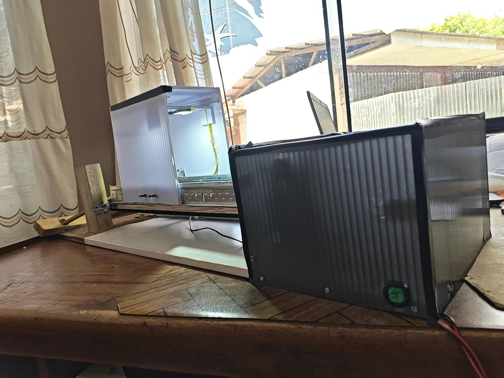
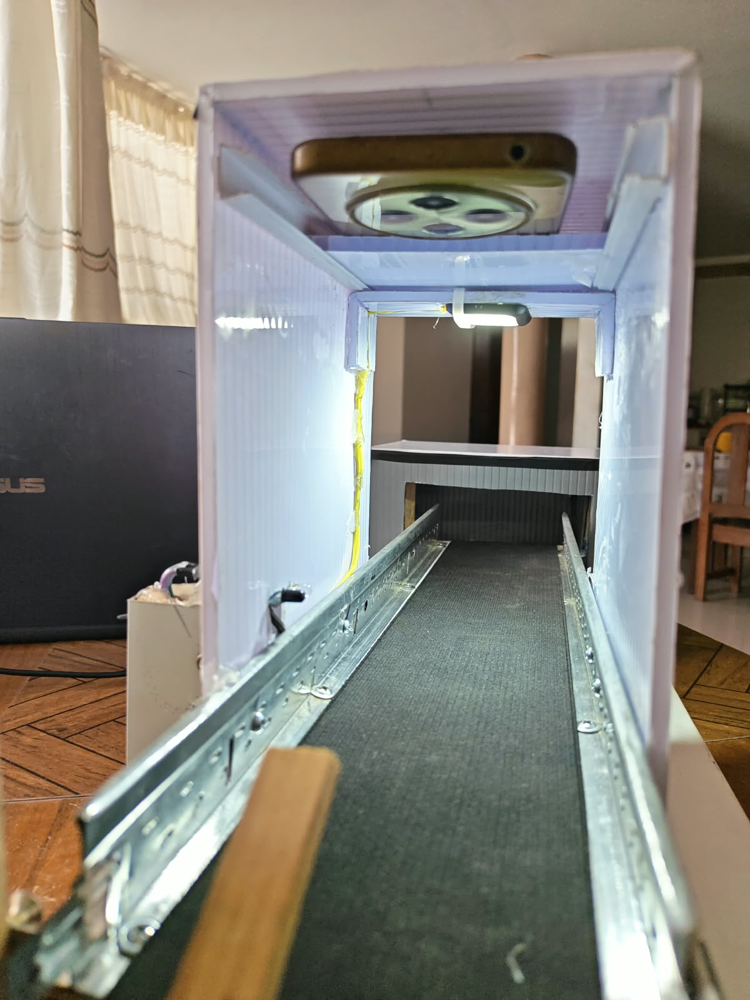
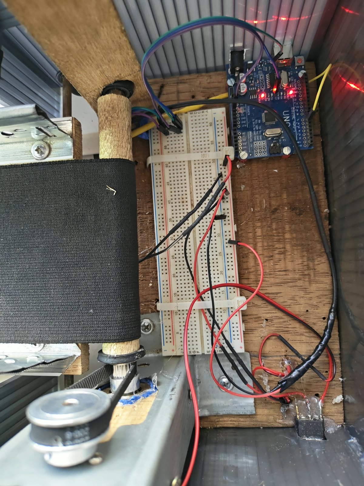
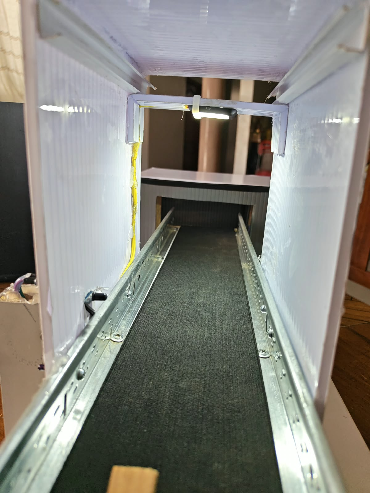
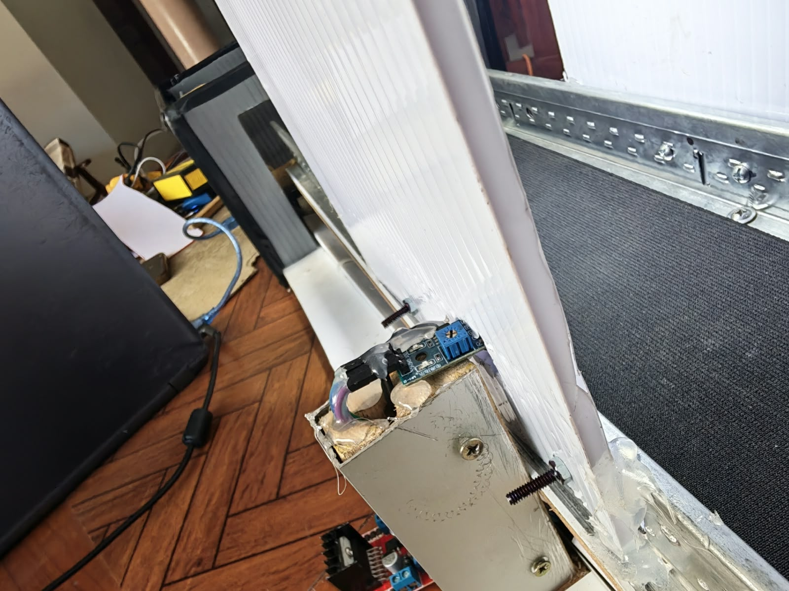
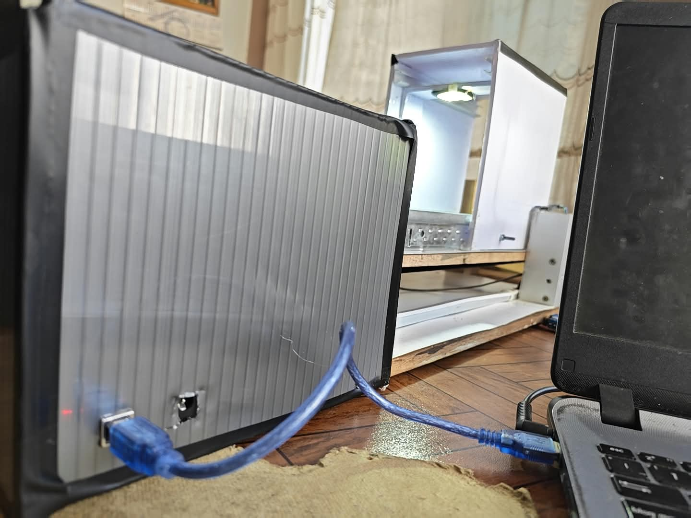
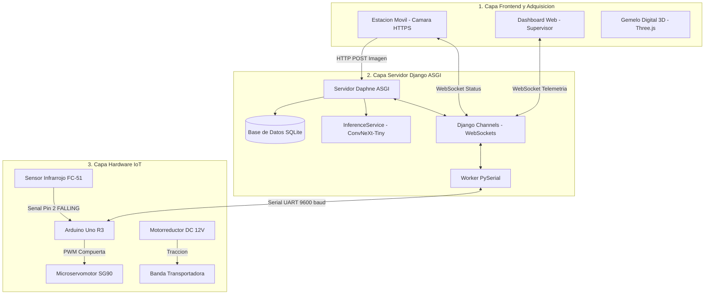
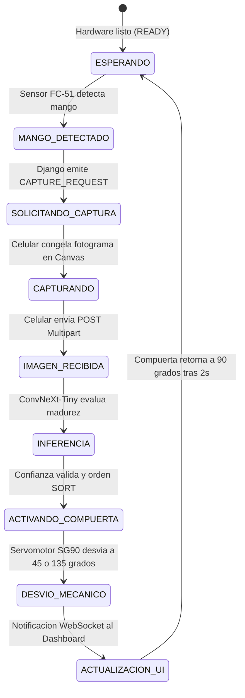

# 🥭 MangoSmart-Sorter: Sistema Inteligente de Clasificación de Mangos en Tiempo Real

[](https://www.djangoproject.com/)
[](https://www.tensorflow.org/)
[](https://www.arduino.cc/)
[](https://threejs.org/)
[](https://www.python.org/)

**MangoSmart-Sorter** es un sistema multidisciplinario integrado de software web asíncrono, inteligencia artificial (visión computacional con redes neuronales profundas) y hardware embebido (Internet de las Cosas - IoT), diseñado para automatizar la detección y separación física del mango **Khirsapat** en las categorías **Maduro** e **Inmaduro** en una línea transportadora continua.

El proyecto articula una **estación de adquisición óptica móvil (HTTPS/WebRTC)**, un **servidor central asíncrono (Django ASGI + Daphne + Channels)**, un **motor de inferencia en tiempo real (`ConvNeXt-Tiny`)**, un **panel de supervisión en vivo (Dashboard)** y una **estación electromecánica clasificadora (Arduino Uno R3, sensor infrarrojo FC-51 y compuerta con microservomotor SG90)**.

---

## 📸 Galería Visual del Prototipo Físico

A continuación se presentan las vistas reales del prototipo funcional implementado y sus módulos principales:

|                            Vista General del Prototipo                            |                       Cámara de Inspección y Soporte Cenital                       |
| :-------------------------------------------------------------------------------: | :-----------------------------------------------------------------------------------: |
|            |      |
| *Estación completa: faja transportadora, túnel difusor y gabinete de control* | *Túnel difusor con lámpara LED COB, soporte de smartphone y compuerta de desvío* |

|                           Gabinete Electrónico de Control                           |                  Banda Transportadora y Túnel Difusor                  |
| :-----------------------------------------------------------------------------------: | :---------------------------------------------------------------------: |
|      |          |
| *Interior del gabinete: Arduino Uno R3, protoboard 830 pts y fuentes duales 12V/5V* | *Banda continua antirreflejante de 10 cm con rieles guía perforados* |

|                     Sensor IR FC-51 y Soporte de Salida                     |                      Enlace Serial con Servidor Central                      |
| :-------------------------------------------------------------------------: | :--------------------------------------------------------------------------: |
|            |  |
| *Módulo sensor infrarrojo FC-51 con comparador LM393 y ajuste de umbral* |  *Conexión física USB-UART a 9 600 baudios con el servidor Django ASGI*  |

---

## 🏗️ Arquitectura Integral del Sistema

El sistema opera bajo una arquitectura desacoplada de tres capas con comunicación bidireccional asíncrona en tiempo real:



### Descripción de las Capas del Sistema:

1. **Capa Frontend / Adquisición:**

   - **Estación Móvil:** Celular en soporte cenital ($90^\circ$) que utiliza la API `navigator.mediaDevices.getUserMedia` bajo HTTPS para capturar fotogramas automáticos en un `<canvas>` al recibir la orden `CAPTURE_REQUEST` por WebSocket.
   - **Dashboard del Supervisor:** Interfaz web en tiempo real con monitoreo de lotes, conteo de mangos maduros/inmaduros, visualización de latencias y calibración manual de compuerta.
   - **Gemelo Digital 3D:** Visor interactivo en Three.js/WebGL para inspección y simulación 3D del prototipo.
2. **Capa Backend / Servidor Central:**

   - **Daphne (Servidor ASGI) + Django 5.2:** Orquesta las peticiones HTTP REST y el ciclo de vida asíncrono.
   - **Django Channels + Redis:** Administra la capa de canales y la transmisión bidireccional por WebSockets sin bloqueos.
   - **InferenceService (Singleton):** Mantiene el modelo neuronal `ConvNeXt-Tiny` en memoria RAM para inferencias en $\approx 21.5\text{ ms}$.
   - **ArduinoService:** Hilo de escucha en segundo plano (*worker thread*) que gestiona la comunicación con el microcontrolador vía PySerial.
3. **Capa Hardware / IoT:**

   - **Arduino Uno R3:** Microcontrolador con firmware en C++ que atiende interrupciones por flanco de bajada del sensor infrarrojo FC-51 y controla la posición del microservomotor SG90.
   - **Mecanismo de Desvío:** Compuerta deflectora calibrada a $45^\circ$ (Maduro), $135^\circ$ (Inmaduro) y retorno a $90^\circ$ (Neutral).
   - **Sistema de Transporte:** Banda transportadora continua impulsada por motorreductor de 12 V con transmisión síncrona GT2-6.

---

## 🔄 Flujo Operativo y Ciclo de Clasificación

El proceso sigue un ciclo cerrado automatizado sin bloqueos de ejecución:



---

## 🛠️ Especificaciones de Hardware y Materiales

El prototipo físico fue ensamblado a partir de los 17 componentes técnicos especificados en la investigación:

|      N.°      | Componente / Material            | Modelo / Especificación técnica                           | Función en el sistema                                                                          |
| :-------------: | :------------------------------- | :---------------------------------------------------------- | :---------------------------------------------------------------------------------------------- |
|   **1**   | **Placa de desarrollo**    | Arduino Uno R3 (ATmega328P, 16 MHz)                         | Procesamiento embebido, lectura de interrupciones y control del servomotor.                     |
|   **2**   | **Actuador de compuerta**  | Microservomotor SG90 (5 V DC)                               | Accionamiento mecánico de la compuerta de desvío ($45^\circ$, $90^\circ$, $135^\circ$). |
|   **3**   | **Sensor de presencia**    | Sensor Infrarrojo FC-51 (LM393 ajustable)                   | Detección óptica del fruto en la entrada y disparo de interrupción en Pin 2.                 |
|   **4**   | **Motor de tracción**     | Motorreductor DC JGA25-370 (12 V DC)                        | Tracción continua a velocidad constante de la banda transportadora.                            |
|   **5**   | **Fuente de potencia**     | Adaptador 12 V DC / 2 A                                     | Alimentación exclusiva del motorreductor para aislar ruido inductivo.                          |
|   **6**   | **Fuente de lógica**      | Adaptador regulado 5 V DC / 2 A                             | Alimentación independiente para el servomotor, sensor IR y lógica de control.                 |
|   **7**   | **Interruptor general**    | Switch basculante redondo (*Rocker Switch*)               | Encendido y apagado general del sistema de transporte.                                          |
|   **8**   | **Placa de pruebas**       | Protoboard de 830 puntos                                    | Distribución de líneas de alimentación y señales digitales.                                 |
| **9-10** | **Cableado**               | Jumpers Dupont Macho-Macho y Hembra-Macho                   | Conexión e interconexión modular de señales.                                                 |
|  **11**  | **Banda transportadora**   | Lona elástica sintética (Ancho útil: 10 cm)              | Superficie continua y antirreflejante de soporte del fruto.                                     |
|  **12**  | **Transmisión síncrona** | Poleas y correa dentada GT2-6 (Ancho 6 mm)                  | Acoplamiento síncrono del eje del motor al rodillo principal.                                  |
| **13-14** | **Rodillos y guías**      | Rodillo con polímero + Rueda metálica con rodamiento      | Guiado, soporte y reducción de fricción en la banda.                                          |
|  **15**  | **Bastidor estructural**   | Perfil Tee Principal CKM T417 (1 m)                         | Estructura rígida de soporte para el montaje de la faja y componentes.                         |
|  **16**  | **Cámara de inspección** | Lámina de policarbonato alveolar blanco ($2\text{ m}^2$) | Túnel difusor cerrado para aislamiento lumínico y gabinete de control.                        |
|  **17**  | **Iluminación cenital**   | Lámpara LED compacta tecnología COB (6 500 K)             | Iluminación uniforme sin sombras para la captura de imágenes.                                 |

---

## ⚡ Protocolo de Comunicación Serial (PySerial)

La sincronización entre el servidor backend y el microcontrolador `Arduino Uno R3` se establece vía USB-UART a **9 600 baudios**:

| Emisor$\rightarrow$ Receptor                                                                                                                   | Trama de comando  | Acción / Significado                                                      |
| :----------------------------------------------------------------------------------------------------------------------------------------------- | :---------------- | :------------------------------------------------------------------------- |
| `Arduino` $\rightarrow$ `Servidor`                                                                                                         | `READY`         | Notificación de encendido exitoso y hardware en espera de eventos.        |
| `Arduino` $\rightarrow$ `Servidor`                                                                                                         | `DETECTED`      | Detección confirmada del fruto por el sensor FC-51 en Pin 2.              |
| `Servidor` $\rightarrow$ `Arduino`                                                                                                         | `SORT:MATURE`   | Orden de clasificación para mango maduro; el servo gira a$45^\circ$.    |
| `Servidor` $\rightarrow$ `Arduino`                                                                                                         | `SORT:IMMATURE` | Orden de clasificación para mango inmaduro; el servo gira a$135^\circ$. |
| `Servidor` $\rightarrow$ `Arduino` | `SORT:REVIEW` | Retención en posición neutral ($90^\circ$) ante inferencias con baja confianza. |                   |                                                                            |
| `Servidor` $\rightarrow$ `Arduino`                                                                                                         | `PING`          | Trama de diagnóstico para verificación de latencia de enlace serial.     |
| `Arduino` $\rightarrow$ `Servidor`                                                                                                         | `ACK:<COMANDO>` | Mensaje de confirmación emitido por el Arduino tras ejecutar la acción.  |

---

## 📊 Métricas y Rendimiento Operativo del Sistema

- **Arquitectura Neuronal Seleccionada:** `ConvNeXt-Tiny` (TensorFlow/Keras).
- **Entrada del Modelo:** Tensores normalizados de $224 \times 224$ píxeles, 3 canales RGB.
- **Latencia de Inferencia Neuronal:** $21,53\text{ ms}$ (en CPU estándar).
- **Latencia Total End-to-End (Web + IA):** $62,96\text{ ms}$ (Recepción, decodificación, inferencia, BD y WebSockets).
- **Tiempo de Ciclo Completo por Fruto:** $\approx 2,18\text{ s}$ (Transporte, detección, foto, inferencia y desvío).
- **Eficacia de Clasificación en Pruebas Físicas:** $98,00\,\%$ de precisión en faja transportadora.
- **Efectividad Mecánica de Desvío:** $100\,\%$ sin atascamientos ni falsos disparos.

---

## 🌐 Visor 3D Interactivo (Gemelo Digital)

El proyecto incluye un **visor 3D interactivo en WebGL/Three.js** que permite inspeccionar la maqueta, probar el servomotor y simular el ciclo de clasificación en tiempo real:

- **Ruta local:** [`prototipo/visor_3d.html`](prototipo/visor_3d.html)
- **Características:**
  - 🔄 Rotación $360^\circ$ e inspección orbital con iluminación ambiental de estudio.
  - 🥭 Simulación animada: Detección por sensor IR $\rightarrow$ Captura fotográfica con flash $\rightarrow$ Inferencia $\rightarrow$ Desvío por servomotor.
  - 🔍 **Modo Rayos X:** Transparencia del túnel de policarbonato y gabinete de control.
  - 📐 Vistas de cámara preconfiguradas: Isométrica, Cenital ($90^\circ$), Lateral, Interior del túnel y Arduino.
  - 📸 **Botón Captura HD:** Exportación de renders en alta resolución para informes y diapositivas.

---

## 📂 Estructura del Repositorio

```
MangoSmart-Sorter/
├── manage.py                     # Punto de entrada de comandos Django
├── requirements.txt              # Dependencias de Python
├── README.md                     # Documentación general del proyecto
├── .env                          # Variables de entorno activas
├── .env.example                  # Plantilla de configuración
├── db.sqlite3                    # Base de datos relacional local
├── docs/                         # Documentación gráfica y capturas
│   └── images/                   # Fotografías organizadas del prototipo
├── mangosort/                    # Configuración central del proyecto
│   ├── settings.py               # Ajustes Django, Channels y CORS
│   ├── asgi.py                   # Configuración del servidor ASGI Daphne
│   └── routing.py                # Enrutador de WebSockets
├── classification/               # Módulo de visión artificial e inferencia
│   ├── models.py                 # Modelo 'Clasificacion' (latencias, probabilidades)
│   ├── views.py                  # Endpoint POST /api/classifications/capture/
│   ├── consumers.py              # WebSocket de lotes en tiempo real
│   └── services/                 # Singleton InferenceService (ConvNeXt-Tiny)
├── hardware/                     # Control embebido y comunicación serial
│   ├── models.py                 # 'EventoHardware' y 'ConfiguracionSistema'
│   ├── views.py                  # Calibración y comandos manuales de servo
│   └── services/                 # PySerial worker y gestor de tramas
├── monitoring/                   # Vistas principales y telemetría
│   ├── models.py                 # 'Lote' y 'Dispositivo'
│   └── views.py                  # Vistas HTML (Dashboard, Cámara, Historial)
├── templates/                    # Plantillas HTML (Bootstrap 5)
├── static/                       # Estilos CSS y scripts JavaScript nativos
├── prototipo/                    # Recursos de la estación física clasificadora
│   ├── visor_3d.html             # Gemelo digital 3D interactivo (Three.js)
│   ├── componentes.xlsx          # Catálogo oficial de componentes
│   ├── inventario_materiales_completo.md # Ficha técnica de materiales
│   └── *.jpeg                    # Fotografías originales
├── ml_models/                    # Modelos entrenados (.keras) y configuraciones
│   └── ConvNeXtTiny_madurez_mango_final.keras
└── arduino/                      # Firmware de microcontrolador
    └── mango_sorter/
        └── mango_sorter.ino      # Sketch en C++ con interrupciones hardware
```

---

## 🚀 Guía de Instalación y Puesta en Marcha

### 1. Requisitos del Sistema

- **Python 3.12**
- **Redis Server** (ejecutándose en `localhost:6379`)
- **Arduino IDE** (para carga del firmware en `Arduino Uno R3`)

### 2. Entorno Virtual e Instalación de Dependencias

```bash
# Crear entorno virtual
python -m venv venv

# Activar entorno virtual
# En Windows:
.\venv\Scripts\activate
# En Linux / macOS:
source venv/bin/activate

# Instalar librerías
pip install -r requirements.txt
```

### 3. Configuración de Variables de Entorno

Copia el archivo `.env.example` a `.env`:

```bash
cp .env.example .env
```

Para pruebas de desarrollo sin hardware físico conectado:

```ini
ML_MODEL_MODE=active
ARDUINO_MODE=mock
```

### 4. Migraciones y Superusuario

```bash
# Aplicar migraciones de base de datos
python manage.py migrate

# Crear configuración inicial
python manage.py shell -c "from hardware.models import ConfiguracionSistema; ConfiguracionSistema.objects.get_or_create(id=1)"
```

### 5. Iniciar el Servidor Web (ASGI con Daphne)

```bash
# Modo HTTP / WebSocket estándar:
daphne -b 0.0.0.0 -p 8000 mangosort.asgi:application

# O modo desarrollo con soporte SSL para cámara móvil:
python manage.py runsslserver 0.0.0.0:8000
```

---

## 📱 Conexión de la Estación de Captura Móvil (HTTPS)

Para capturar imágenes con la cámara trasera del celular mediante `navigator.mediaDevices.getUserMedia()`, el navegador exige conexión cifrada **HTTPS**:

1. Obtén tu IP local (ej. `192.168.1.105`) mediante `ipconfig` (Windows) o `ifconfig` (Linux).
2. Agrega la IP a `ALLOWED_HOSTS` en tu `.env`.
3. Inicia el servidor con `python manage.py runsslserver 0.0.0.0:8000`.
4. En el celular (conectado a la misma red WiFi), ingresa a `https://192.168.1.105:8000/camera/` y acepta los permisos de cámara.

---

## 🧪 Pruebas Unitarias Automatizadas

Ejecuta la suite de pruebas unitarias para validar modelos, serializadores y enrutamiento:

```bash
python manage.py test
```

---

## 👥 Autores y Tesis

- **Proyecto:** *MangoSmart-Sorter*
- **Investigación:** Clasificación y detección automática de la madurez del mango Khirsapat mediante visión computacional, aprendizaje profundo y sistemas embebidos.
