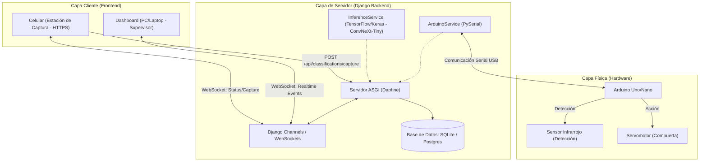
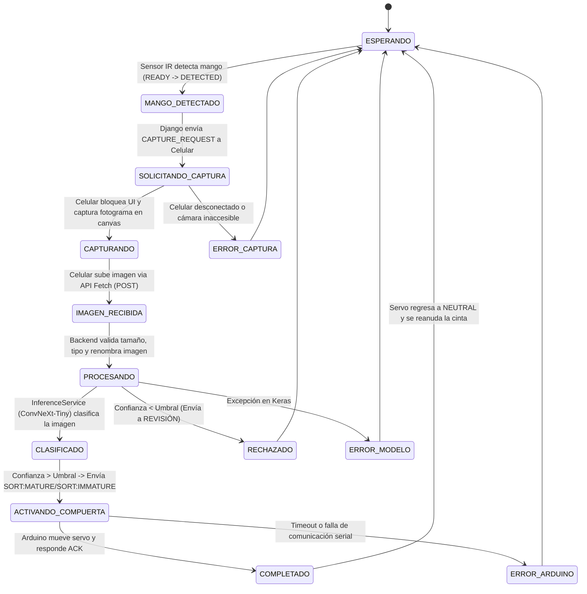

# 🥭 MangoSmart-Sorter: Clasificación Automática de Mangos en Tiempo Real

**MangoSmart-Sorter** es un sistema multidisciplinario integrado de software, inteligencia artificial (visión artificial con TensorFlow/Keras) y hardware (Internet de las Cosas - IoT) diseñado para clasificar mangos en las categorías **Maduro** e **Inmaduro** de forma automatizada en una cinta transportadora.

El sistema se compone de una estación de captura móvil (celular), un servidor de inferencia central (Django + Daphne + Keras), una consola de supervisión en tiempo real (Dashboard de PC) y un controlador físico de compuerta de desvío (Arduino).

---

## 🏗️ Arquitectura del Sistema

El sistema sigue una arquitectura desacoplada de tres capas bien delimitadas:



1. **Capa Cliente (Frontend Multidispositivo)**:
   - **Estación de Captura (Celular)**: Utiliza la cámara trasera en un contexto seguro HTTPS para capturar fotogramas JPEG mediante un `<canvas>` y enviarlos al backend a través de la API Fetch. Se conecta al WebSocket para recibir la señal de captura automática del sensor.
   - **Dashboard del Supervisor (PC/Laptop)**: Panel responsive en tiempo real que muestra contadores, latencias, estado de los dispositivos y controles manuales de calibración de servomotor.
2. **Capa de Servidor (Django Backend + ASGI)**:
   - **Daphne + Django Channels**: Gestiona WebSockets bidireccionales en tiempo real y el servidor HTTP asíncrono.
   - **InferenceService**: Servicio Singleton que mantiene cargado en memoria el modelo ConvNeXt-Tiny (`.keras`) de TensorFlow y realiza inferencias instantáneas en imágenes RGB de `224x224`.
   - **ArduinoService (PySerial)**: Servicio asíncrono que administra el puerto serial y coordina la recepción de detecciones del sensor e instrucciones a la compuerta.
3. **Capa Física (Hardware/IoT)**:
   - **Arduino Uno/Nano**: Firmware que monitorea el sensor de proximidad infrarrojo y acciona el servomotor de la compuerta según el resultado de la clasificación.

---

## 🔄 Flujo de Trabajo y Máquina de Estados

El proceso de clasificación sigue un flujo ordenado y controlado para evitar bloqueos seriales y procesamientos duplicados:



---

## 🛠️ Tecnologías Empleadas

### Backend
- **Python 3.12**
- **Django 5.2 LTS** & **Django REST Framework (DRF)**
- **Django Channels 4.1+** (con **Daphne** como servidor ASGI y **Redis** como channel layer)
- **PySerial 3.5** para comunicación con Arduino
- **python-dotenv** para gestión de variables de entorno

### Inteligencia Artificial
- **TensorFlow / Keras 2.20.0** (Inferencia en CPU o GPU CUDA)
- **Pillow** para carga de imágenes y preprocesamiento
- **OpenCV** para validación opcional de fotogramas

### Frontend
- **HTML5** & **CSS3** (Bootstrap 5)
- **Vanilla JavaScript** (Moderno, sin frameworks pesados, Fetch API y WebSocket nativo)

### Hardware (IoT)
- **Arduino Nano / Uno**
- **Servomotor de rotación posicional**
- **Sensor Infrarrojo de proximidad (IR)**

---

## 📂 Estructura de Carpetas

El proyecto está diseñado bajo una arquitectura limpia y modularizada para evitar mezclar lógica de interfaz, inferencia, base de datos y control físico:

```
MangoSmart-Sorter/
├── manage.py
├── requirements.txt
├── README.md
├── .env                  # Variables locales activas
├── .env.example          # Plantilla de variables de entorno
├── .gitignore
├── db.sqlite3            # Base de datos de desarrollo
├── mangosort/            # Configuración del proyecto Django
│   ├── settings.py
│   ├── urls.py
│   ├── asgi.py
│   └── routing.py
├── classification/       # Gestión de inferencia de visión artificial
│   ├── models.py         # Modelo 'Clasificacion'
│   ├── views.py          # Endpoint POST /api/classifications/capture/
│   ├── urls.py
│   ├── serializers.py
│   ├── consumers.py      # Lógica de WebSockets por lote
│   ├── routing.py
│   ├── admin.py
│   ├── tests.py          # Pruebas unitarias de carga e inferencia
│   └── services/         # Servicios de soporte (Inferencia)
├── hardware/             # Lógica de Arduino y comunicación serial
│   ├── models.py         # 'EventoHardware' y 'ConfiguracionSistema' (Singleton)
│   ├── views.py          # Calibración, estados del puerto y comandos
│   ├── admin.py
│   ├── tests.py
│   └── services/         # PySerial, Mock Arduino, etc.
├── monitoring/           # Vistas web principales y control de lotes
│   ├── models.py         # 'Lote' y 'Dispositivo'
│   ├── views.py          # Renderización de HTML (Home, Dashboard, Cámara, Historial)
│   ├── urls.py
│   ├── serializers.py
│   ├── admin.py
│   └── tests.py          # Pruebas de base de datos y lógica de lotes
├── templates/            # Plantillas HTML (Base, Home, Dashboard, Camera, Settings, History)
├── static/               # Archivos estáticos (CSS personalizado y Javascript)
│   ├── css/
│   │   └── styles.css
│   └── js/
│       ├── camera.js
│       ├── dashboard.js
│       └── websocket.js
├── media/                # Almacenamiento de imágenes de mangos procesados
│   └── classifications/
├── ml_models/            # Modelos entrenados y archivos de configuración
│   ├── ConvNeXtTiny_madurez_mango_final.keras
│   └── ConvNeXtTiny_madurez_mango.config.json
└── arduino/
    └── mango_sorter/
        └── mango_sorter.ino # Firmware de Arduino
```

---

## 🚀 Guía de Instalación y Configuración

### 1. Requisitos Previos
- **Python 3.12** instalado en el sistema.
- **Redis** instalado y ejecutándose localmente (por defecto en el puerto `6379`).
  - *En Windows*: Puedes instalarlo mediante WSL (Windows Subsystem for Linux) o descargar el instalador nativo de Redis para Windows.

### 2. Clonación y Entorno Virtual
Abre una terminal y ejecuta:
```bash
# Crear entorno virtual
python -m venv venv

# Activar entorno virtual (Windows)
.\venv\Scripts\activate

# Activar entorno virtual (Linux/macOS)
source venv/bin/activate

# Instalar dependencias
pip install -r requirements.txt
```

### 3. Configuración de Variables de Entorno
Copia el archivo `.env.example` como `.env` y edítalo según sea necesario:
```bash
cp .env.example .env
```
Asegúrate de configurar los modos de simulación durante el desarrollo inicial:
```ini
# Usar 'mock' en desarrollo si no tienes la GPU o el modelo Keras de 150MB inicializado,
# o si no tienes un Arduino conectado al puerto serial.
ML_MODEL_MODE=mock
ARDUINO_MODE=mock
```

### 4. Base de Datos y Superusuario
Ejecuta las migraciones de Django para inicializar las tablas de base de datos locales (SQLite) y crea el administrador:
```bash
# Crear y aplicar migraciones
python manage.py makemigrations
python manage.py migrate

# Crear el superusuario administrador de Django Admin
python manage.py shell -c "from django.contrib.auth import get_user_model; User = get_user_model(); User.objects.create_superuser('admin', 'admin@example.com', 'admin123') if not User.objects.filter(username='admin').exists() else None"

# Inicializar configuración del sistema
python manage.py shell -c "from hardware.models import ConfiguracionSistema; ConfiguracionSistema.objects.get_or_create(id=1)"
```
*Las credenciales por defecto creadas son: usuario `admin`, contraseña `admin123`*. Puedes acceder a ellas en `http://localhost:8000/admin/`.

---

## 📱 Acceso desde Dispositivos Móviles (HTTPS local)

Para poder acceder a la cámara del celular desde la red local mediante `navigator.mediaDevices.getUserMedia()`, el navegador móvil **exige obligatoriamente una conexión segura HTTPS**.

### Método 1: Servidor SSL de Desarrollo de Django (Recomendado)
El proyecto incluye la biblioteca `django-sslserver` instalada. 
1. Obtén la dirección IP local de tu computadora en la red WiFi:
   - *En Windows*: Ejecuta `ipconfig` en el símbolo del sistema (ej. `192.168.1.105`).
   - *En Linux/macOS*: Ejecuta `hostname -I` o `ifconfig`.
2. Añade esa IP local al campo `ALLOWED_HOSTS` en tu archivo `.env`:
   ```ini
   ALLOWED_HOSTS=localhost,127.0.0.1,192.168.1.105
   ```
3. Inicia el servidor HTTPS de desarrollo:
   ```bash
   python manage.py runsslserver 0.0.0.0:8000
   ```
4. En tu celular conectado a la **misma red WiFi**, ingresa a la dirección: `https://192.168.1.105:8000/`. El navegador móvil mostrará una advertencia de seguridad por el certificado auto-firmado; presiona "Configuración avanzada" y selecciona **"Acceder de todos modos"** para otorgar los permisos de cámara de forma segura.

### Método 2: Túnel seguro con ngrok (Alternativo)
Si no deseas configurar certificados locales, puedes crear un túnel público seguro:
1. Descarga e inicia ngrok:
   ```bash
   ngrok http 8000
   ```
2. Copia la URL HTTPS pública generada por ngrok (ej. `https://xxxx-xx.ngrok-free.app`).
3. Agrega el dominio de ngrok a `ALLOWED_HOSTS` en tu `.env`.
4. Abre esa URL en tu celular para activar el stream de la cámara trasera.

---

## 🧪 Ejecución de Pruebas Unitarias
El sistema cuenta con pruebas automatizadas integradas para validar los modelos, aserciones de nombres seguros e incrementos de secuencias:
```bash
python manage.py test
```
Resultados esperados:
```cmd
Ran 9 tests in 0.108s

OK
```
